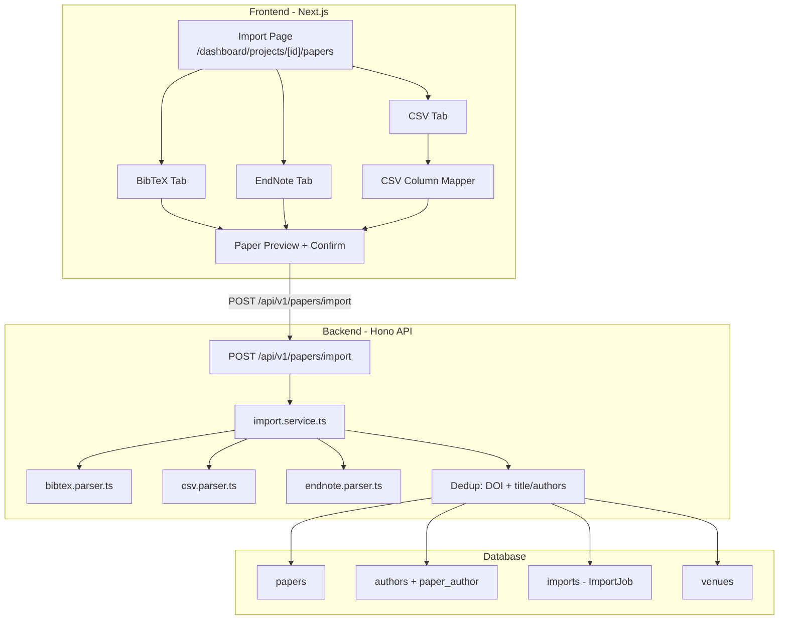

# Paper Import Feature Implementation

## Architecture



## Key Files to Create/Modify

### Backend (apps/primary-backend)

**New files:**
- `src/services/parsers/bibtex.parser.ts` - Parse `.bib` file content into normalized paper objects
- `src/services/parsers/csv.parser.ts` - Parse CSV content with configurable column mapping
- `src/services/parsers/endnote.parser.ts` - Parse EndNote/RIS format into normalized papers
- `src/services/import.service.ts` - Orchestrate parsing, deduplication, and DB insertion

**Modified files:**
- [`apps/primary-backend/src/routes/papers.ts`](apps/primary-backend/src/routes/papers.ts) - Replace the `POST /import` stub with real implementation
- [`apps/primary-backend/package.json`](apps/primary-backend/package.json) - Add parser dependencies

### Frontend (apps/frontend)

**New files:**
- `app/dashboard/projects/[id]/papers/page.tsx` - Main import page with tabs
- `app/dashboard/projects/[id]/papers/components/bibtex-import.tsx` - BibTeX upload + preview
- `app/dashboard/projects/[id]/papers/components/csv-import.tsx` - CSV upload + column mapper + preview
- `app/dashboard/projects/[id]/papers/components/endnote-import.tsx` - EndNote upload + preview
- `app/dashboard/projects/[id]/papers/components/paper-preview-table.tsx` - Shared preview component
- `app/dashboard/projects/[id]/papers/components/import-results.tsx` - Results summary (imported/skipped/errors)

### No schema changes needed
The Prisma schema already has `Paper`, `Author`, `PaperAuthor`, `Venue`, and `ImportJob` models with all required fields.

---

## Backend Implementation Details

### Parser Dependencies (npm packages)
- `@retorquere/bibtex-parser` or `bibtex-parse` - BibTeX parsing
- `papaparse` - CSV parsing (works in Node/Bun)
- No special package needed for EndNote/RIS - simple line-based format parser

### Import API Contract

**Request** `POST /api/v1/papers/import`:
```typescript
{
  format: 'bibtex' | 'csv' | 'endnote',
  content: string,          // raw file content
  projectId: string,
  // CSV-specific:
  columnMapping?: {
    title: number,          // column index
    authors?: number,
    year?: number,
    doi?: number,
    abstract?: number,
    bibtexKey?: number,
    url?: number,
    keywords?: number,
  },
  startRow?: number,        // skip header rows (default 1)
}
```

**Response** (synchronous for now, upgrade to async job later if needed):
```typescript
{
  imported: number,
  duplicates: number,
  errors: { row: number, message: string }[],
  importJobId: string,     // links to ImportJob record
}
```

### Deduplication Logic (matching legacy Paper.php `paper_exist()`)
1. If paper has DOI -> check `papers` table for matching DOI in same project
2. If no DOI match -> check by title similarity AND author last-name matching
3. Skip paper if duplicate found (increment `duplicates` counter)

### Paper Insertion (matching legacy `insert_paper_bibtext()`)
For each non-duplicate paper:
1. Upsert `Author` records (by name match)
2. Create `PaperAuthor` join records with `order`
3. Upsert `Venue` if venue info is present
4. Insert `Paper` with `screeningStatus: PENDING`, `classificationStatus: WAITING`, `operationCode`, `addedBy`
5. Create `ImportJob` record tracking the batch

---

## Frontend Implementation Details

### Import Page UX Flow

**Tab 1: BibTeX / Tab 3: EndNote**
1. Drag-and-drop or file picker (accept `.bib` / `.enl`, `.ris`)
2. File content is read client-side via `FileReader`
3. Show file metadata (name, size)
4. Click "Parse and Preview" -> call a lightweight client-side preview (or just show raw stats)
5. Submit to backend -> show results

**Tab 2: CSV**
1. Option A: Download template button (pre-filled headers)
2. Option B: Upload any CSV
3. After upload -> parse first 10 rows client-side with PapaParse
4. Show column mapping UI: dropdowns for each paper field (title, authors, year, DOI, abstract, keywords, URL, bibtexKey)
5. Show preview table with mapped data highlighted
6. "Start from row" selector (skip header rows)
7. Submit with mapping config -> show results

### Shared Components
- **PaperPreviewTable**: Shows parsed papers in a table (bibtexKey, title, authors, year)
- **ImportResults**: Shows imported/duplicate/error counts, expandable error details
- **FileDropZone**: Drag-and-drop area with file type validation

---

## Key Parity with Legacy

| Legacy Feature | NeoReLiS Implementation |
|---|---|
| BiBler web service for BibTeX parsing | Native TS parser (`bibtex-parse`) |
| BiBler `importendnotestringforrelis` | Native TS RIS/EndNote parser |
| CSV column mapping UI | Column mapper component with preview |
| Duplicate detection (DOI + title/authors) | Same logic in `import.service.ts` |
| `operation_code` for batch tracking | `ImportJob.id` + `Paper.operationCode` |
| Paper key auto-generation | Generate key from author+year if missing |
| Source/search-strategy metadata | Supported via `Paper.source` / `Paper.searchStrategy` |
